# Ruby white space strip command line application

This program uses **[Ruby Power](https://www.ruby-lang.org/en/documentation/success-stories/)** to strip whitespace from files, and the accompanying documentation provided aims at being an easy to follow tutorial on all things **[Ruby](https://www.ruby-lang.org/en/)**.  All the links in this README.md briefly explain some of the **[Ruby](https://github.com/ruby/ruby)** topics discussed.

To jump ahead and setup, choose your OS below:

 - [OS X](#mac-os-x-instructions)
 - [Windows](#windows-instructions)

[Matz](https://twitter.com/matz_translated) made Ruby fun to learn so come and check out the [Ruby in 4 seconds](https://youtu.be/ayx4fASYkZU) video.

For those of you who don't know much about [Ruby](http://ruby-doc.org)...

Here's [Ruby Power](http://skillcrush.com/2015/02/02/37-rails-sites/) in five seconds from [Ruby Wikipedia](https://en.wikipedia.org/wiki/Ruby_\(programming_language\))

**[Ruby](http://www.iso.org/iso/iso_catalogue/catalogue_tc/catalogue_detail.htm?csnumber=59579)** was accepted as a [Japanese Industrial Standard](https://en.wikipedia.org/wiki/Japanese_Industrial_Standards) (JIS X 3017) in 2011[25] and an [international standard](http://www.iso.org/iso/home.html) (ISO/IEC 30170) in 2012.

Ruby is growing in popularity and is currently ranked 11th on the [TIOBE Index](http://www.tiobe.com/tiobe_index).

This program runs on the [command line](https://en.wikipedia.org/wiki/Command-line_interface) and accepts a single [parameter](https://en.wikipedia.org/wiki/Parameter_\(computer_programming\)), a folder [path](https://en.wikipedia.org/wiki/Path_\(computing) name.

It checks this folder [recursively](https://en.wikipedia.org/wiki/Recursion) through all sub folders and files for leading and trailing [whitespace](https://en.wikipedia.org/wiki/Whitespace_character).

It removes all the excess leading and trailing whitespace and [copies](https://en.wikipedia.org/wiki/Copy_\(command\)) the folder contents to this projects 'output' [directory](https://en.wikipedia.org/wiki/Directory_\(computing).

So far it has been checked against these [file formats](https://en.wikipedia.org/wiki/File_format):

    - *.c
    - *.xml
    - *.xsl
    - *.txt
    - *.php
    - *.html
    - *.py
    - *.css
    - *.rb
    
    
Coming from a [PHP](http://php.net) background where leading and trailing white space can sometimes be [problematic](https://www.google.com.au/search?client=opera&q=php+leading+whitespace+problem&sourceid=opera&ie=UTF-8&oe=UTF-8) I thought it would be 
interesting to build a command line tool in Ruby (my first command line tool in Ruby)
    
To run simply clone this repo and then open a terminal and navigate to the directory where you cloned to.

Then simply run: ruby ruby-strip.rb path/to/folder 

This should copy the folder to the 'output' directory.  There are currently two test folders for input and output.

The two commands that were run to produce the sample output were:

  - ruby ruby_strip.rb php-test-files 

  - ruby ruby_strip.rb random-test-files
  
If you are still to afraid to dive in and try Ruby, how about some easy free web based interactive courses on basic tech:

- [Try Ruby](http://tryruby.org/levels/1/challenges/0) 
- [Codecademy Ruby](https://www.codecademy.com/learn/ruby) 
- [Learn the command line](https://www.codecademy.com/learn/learn-the-command-line)
- [Try Git](https://www.codeschool.com/courses/try-git)
- [Learn Git](https://www.codecademy.com/learn/learn-git)

And then come train in the [REAL DOJO](http://www.codewars.com) and reach your highest potential, become **faster**, **stronger** and **more powerful**......**JEDI MASTER LEVEL**.....**!??!?!!**  

So now that you are **Ruby Gung-Ho**, the new Ruby [Bruce Lee](https://en.wikipedia.org/wiki/Bruce_Lee) on the street, try the instructions below.

##Mac OS X instructions

[Matz](https://en.wikipedia.org/wiki/Yukihiro_Matsumoto) made Ruby easy to learn, so don't be worried and first check out a short Ruby YouTube video I created.

[Ruby in 29 seconds](https://youtu.be/2ei7S0FU65E)

As mentioned this program uses Ruby so lets see if its installed on your machine, open a terminal and type:

###ruby -v

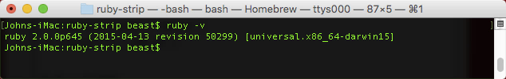

To find out more about Ruby type:

###ruby --help

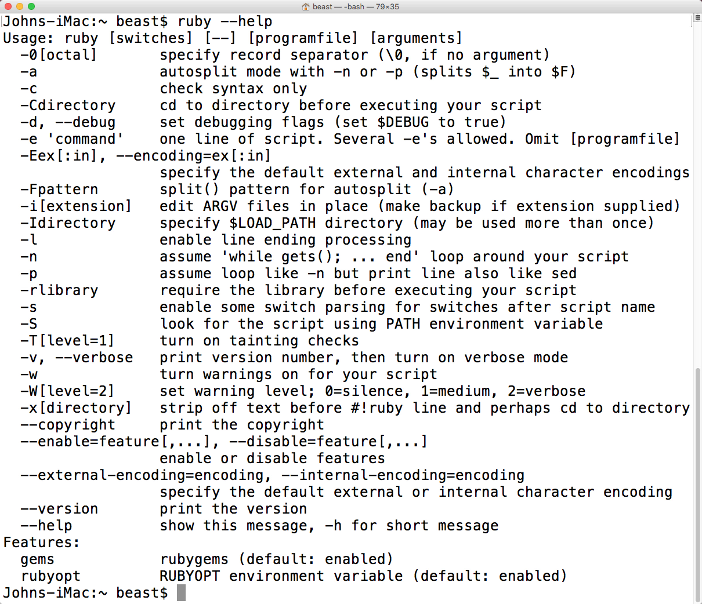

[man pages](https://en.wikipedia.org/wiki/Man_page) contain a lot of information about programs.

###man ruby

You can use the up and down arrows to navigate through the man page or press q to exit.

Ruby also ships with 'ri' a tool used to display information about Ruby Classes, modules and methods from your terminal

A lot of people don't know 'ri' exists and use google search instead.

###man ri

Ruby also ships with a fantastic tool called IRB.  IRB is the interactive Ruby console where you can test out your Ruby commands inside a terminal.  Watch a [short video on Youtube](https://www.youtube.com/watch?v=CpFgz5Iq3qA) that I made on IRB.

###man irb

And to use IRB type:

###irb

You type 'exit' to stop using irb and return to the standard terminal.

You can add 'tab' completion to irb by creating a .irbrc file

You can use the nano editor to create this by entering:

###nano .irbrc

Then entering the next line:

###require 'irb/completion'

The code uses two RubyGems, [fileutils](https://rubygems.org/gems/fileutils) and [rubocop](https://github.com/bbatsov/rubocop) so you must install them, if not already installed.

The 'fileutils' gem requires the [rmagick](https://rubygems.org/gems/rmagick) gem to be installed which requries [imagemagick](http://www.imagemagick.org/script/index.php) to be installed.

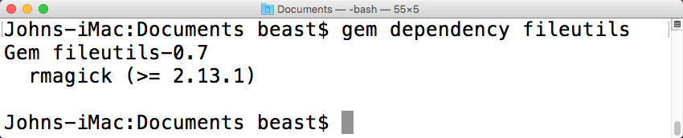

I used [Homebrew](http://brew.sh) to install imagemagick.  Homebrew is the missing package manager for OS X.  It installs the stuff you need that Apple didn't. There is a short Homebrew usage section towards the bottom of this README.

Under the hood Homebrew and [Homebrew formula](http://brewformulas.org) are all Ruby.  For example with Homebrew I installed [Wine](https://www.winehq.org) and then was able to get [Notepad++](https://notepad-plus-plus.org/) running on OS X....

The command to install imagemagick with Homebrew would be:

###brew install imagemagick

You can either install [Bundler](http://bundler.io/) which will install the required gems from the GemFile or install the required gems manually:

Using bundler run:

###gem install bundler

I've added a GemFile so you can use bundler from this projects directory to run:

###bundle install

which will install the required gems.

Alternatively if not using bundler open a terminal and type: 

###gem install rubocop

and

###gem install fileutils

To see the current Gems that are installed on your system type: 

###gem list --local  

Another way to see the installed gems is to type: 

###gem server

This will bring up a locally served web page at http://localhost:8808/ listing information about all the gems.

Type: 

###gem -h  

for more information on the gem command.

Another important gem command is:

###gem help commands

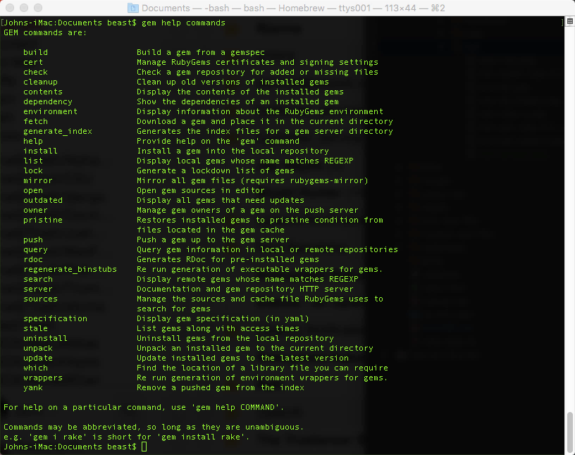

which leads us to:

###gem update

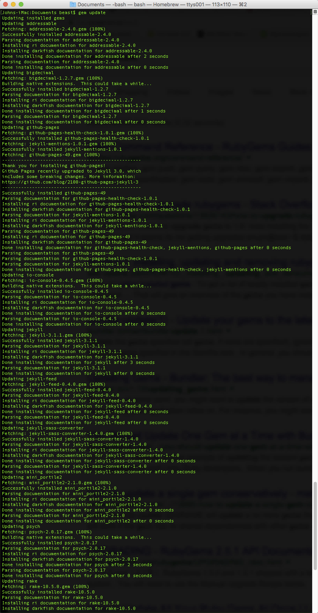

Depending on number of gems installed, your gem update maybe shorter and I have not displayed the full output from the command.

##RVM Usage

RVM is the Ruby Version Manager and it's developed mainly by [Michael Papis](https://github.com/mpapis) on GitHub at https://github.com/rvm/rvm.
 
RVM is a command line tool which allows you to easily install, manage and work with multiple ruby environments or multiple ruby versions so that you can mirror the servers environment.

To find out more about RVM open a terminal and type:

###man rvm

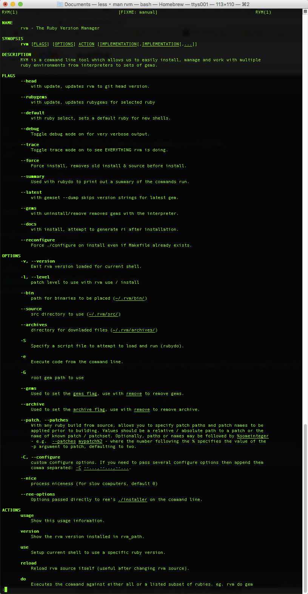

Also you should enter the following command:

###rvm version

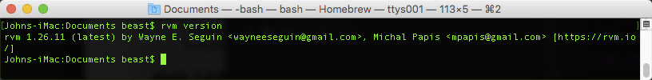
 
You will also want to keep rvm update to date so run:
 
###rvm get stable

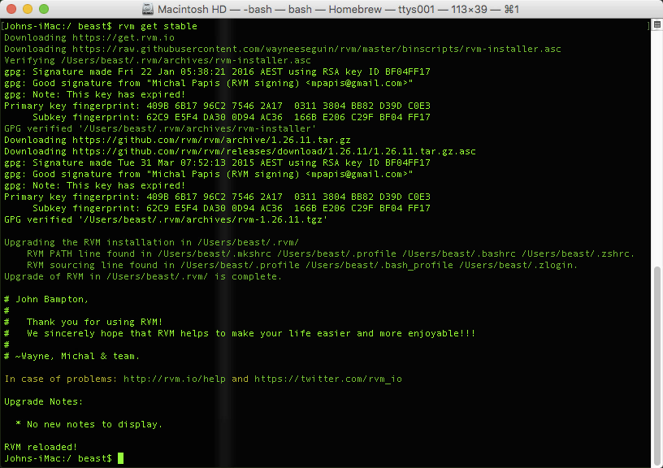 

###rvm list known

###ruby -v 

This will print the current default system installed ruby version.

To install a new Ruby inside rvm, type:

###rvm install ruby-2.2.1

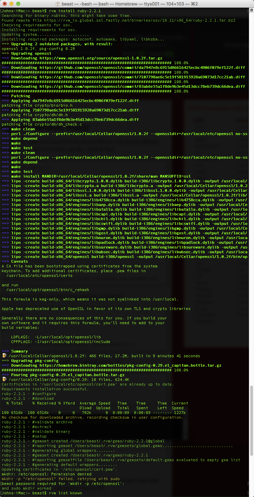

Entering the next command will show which Rubies are installed inside RVM

###rvm list

Followed by: 

###ruby -v

You can see the the RVM installed Ruby is now the system default.

If you would like to switch back to the original system installed Ruby type:

###rvm use system

###ruby -v

To switch back to using an RVM Ruby type:

###rvm use ruby-2.2.1

###ruby -v

You can also enter: 

###which ruby

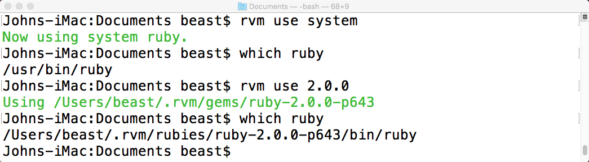

You can read more about the which command by entering:

###man which

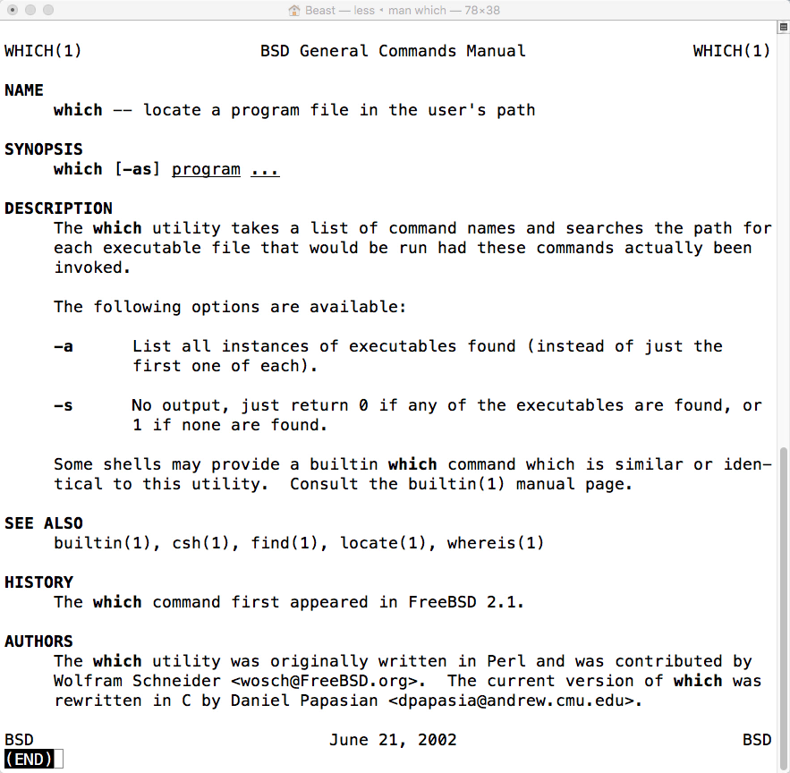

##Homebrew usage

[Homebrew](http://brew.sh) is an amazing package management system that installs the stuff you need that Apple didn't.

[Homebrew Formula](http://brewformulas.org) are written in Ruby.

A made a [video on Homebrew](https://www.youtube.com/watch?v=IonWEFStPio) which runs for under minute that shows the typical brew update command.

If you install Homebrew you should try to run brew update daily.

Once you have installed Homebrew you can run through the basic commands below.

Open a terminal and type:

###man brew

**Before using Homebrew you should ensure it's up to date. Run the next command:**

###brew doctor

##brew update

###brew list
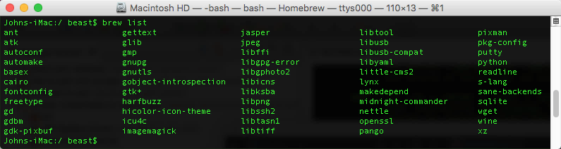

##Windows instructions

To run this program on Windows you will need to install the following software in this order:

 - RubyInstaller
 - Ruby DevKit
 - Imagemagick
 - fileutils gem
 
You can use the RubyInstaller for Windows - http://rubyinstaller.org/ to install Ruby.

Before using the RubyInstaller you should check the integrity of the RubyInstaller against its hash on https://bintray.com/oneclick/rubyinstaller/rubyinstaller

To do this on windows you can use the builtin Windows CertUtil command.

After you have installed Ruby try out the next two commands:

###ruby -v

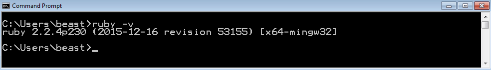

###ruby -h

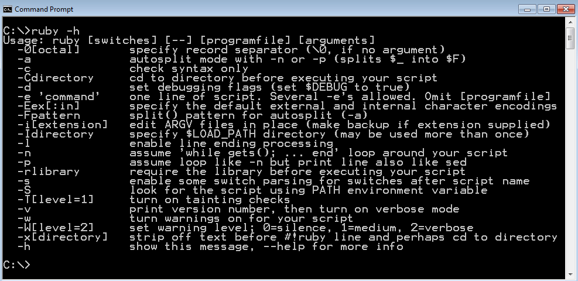

Interactive Ruby Shell or IRB should also be installed as seen below

###irb 

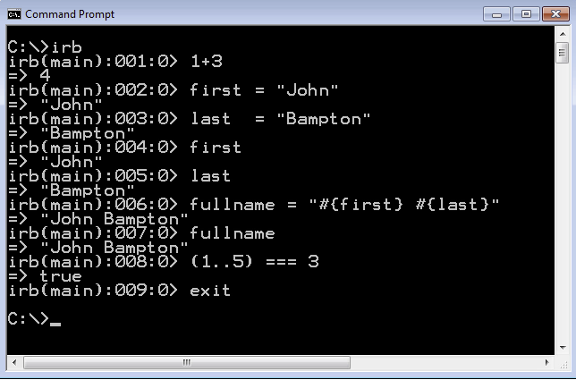

Next you will have to install the Ruby DevKit and then Imagemagick followed by the fileutils RubyGem.

You can download Imagemagick at http://www.imagemagick.org/script/index.php

When you are installing Imagemagick on the - Select Additional Tasks page of the installer, check the box for Install development headers and libraries for C and C++.

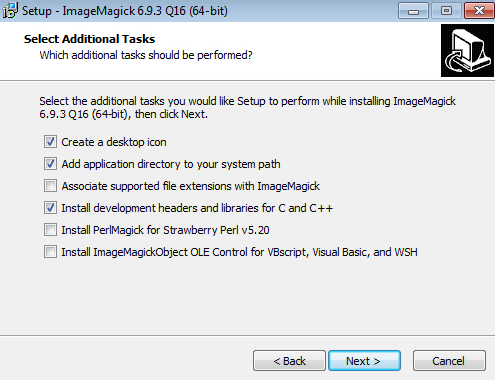

Next you will need to install the "fileutils" gem

###gem install fileutils

To see the current Gems that are installed on your system type: 

###gem list 

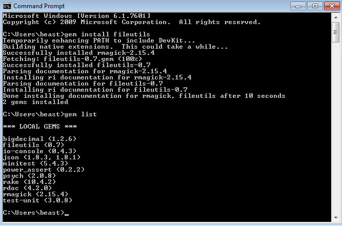

###gem dependency fileutils

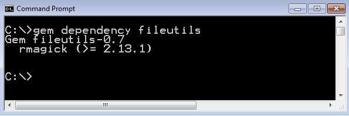

To bring up more information on the gem command type:

###gem -h

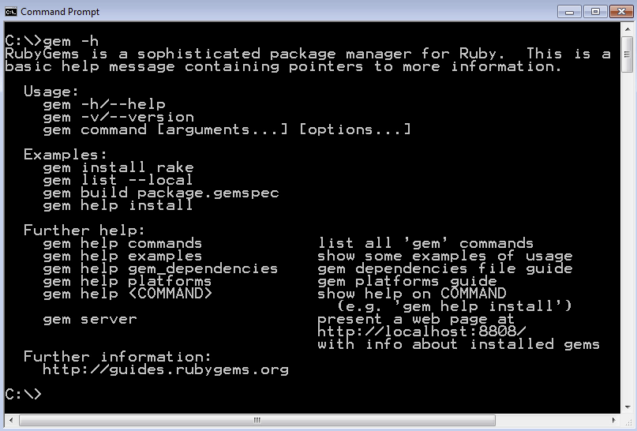

##Resources used on this project and helpful links

Ruby Programming Language - https://www.ruby-lang.org/en/

Ruby Doc - http://ruby-doc.org-doc.org

Ruby the ISO - http://www.iso.org/iso/iso_catalogue/catalogue_tc/catalogue_detail.htm?csnumber=59579

The Ruby Toolbox - https://www.ruby-toolbox.com/

RubyInstaller for Windows - http://rubyinstaller.org/

Homebrew — The missing package manager for OS X - http://brew.sh/

Homebrew formula - http://brewformulas.org

JetBrains RubyMine - https://www.jetbrains.com/ruby/

Ruby Version Manager (RVM) - https://rvm.io/

Ruby regular expression editor - http://rubular.com/

Installing Ruby - https://www.ruby-lang.org/en/documentation/installation/   

Ruby success stories - https://www.ruby-lang.org/en/documentation/success-stories/

Ruby Motion success stories - http://www.rubymotion.com/references/success-stories/

The Top Ruby Jobs - https://toprubyjobs.com/

Australian companies using Rails - https://github.com/rails-oceania/roro/wiki/Australian-Companies-using-Ruby-on-Rails

Codecademy - Learn the Command Line - https://www.codecademy.com/courses/learn-the-command-line

Codecademy - Learn Ruby - https://www.codecademy.com/learn/ruby

CodeSchool - Got 15 minutes and want to learn Git? https://try.github.io/levels/1/challenges/1

CodeSchool Try Ruby - https://www.codeschool.com/courses/try-ruby

IDE - Integrated Development Environment - https://en.wikipedia.org/wiki/Integrated_development_environment

Git (software) - https://en.wikipedia.org/wiki/Git_(software)

man page - https://en.wikipedia.org/wiki/Man_page

Terminal (OS X) - https://en.wikipedia.org/wiki/Terminal_(OS_X)

Essential programmer training - http://www.codewars.com/

Mastering Markdown - https://guides.github.com/features/mastering-markdown/

ImageMagick - http://www.imagemagick.org/script/index.php

Wine - https://www.winehq.org

PHP - http://php.net

One-Click rubyinstaller and DevKit - https://bintray.com/oneclick/rubyinstaller

MinGW - Minimalist GNU for Windows - http://www.mingw.org/

##List of Ruby

https://github.com/ruby/ruby

https://twitter.com/matz_translated

https://twitter.com/yukihiro_matz

https://www.facebook.com/pages/Yukihiro-Matsumoto/109410772411674

https://plus.google.com/communities/101878695540653445908

##Contributions
Fork and pull request. Simple.
